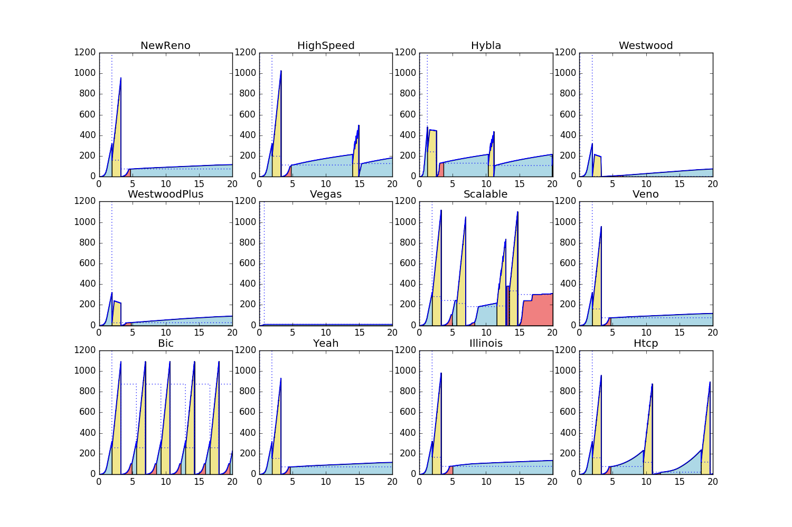
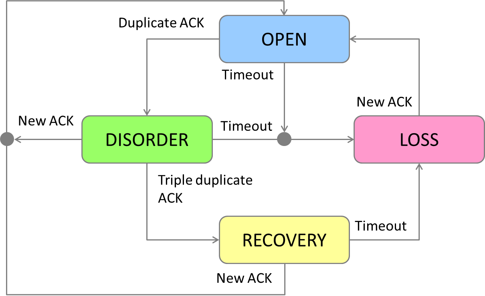
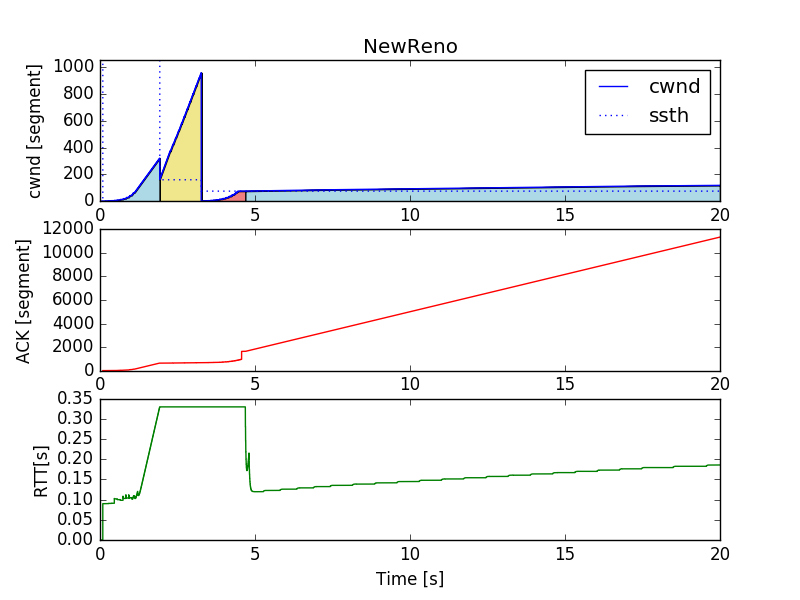

# comparing-tcp-algorithms

Comparing TCP congestion control algorithms with ns-3 and visualizing with matplotlib.



# Requirements

I assume Linux system. You have to install:
* [ns-3](https://www.nsnam.org/): For network simulation. I used version 3.26.
* [Python](https://www.python.org/): I used version 2.7.11.
* [NumPy](http://www.numpy.org/): For data manipulation. I used version 1.10.4.
* [matplotlib](http://matplotlib.org/): For visualization. I used version 1.5.1.

Hereinafter, I assume ns-3.26 is installed in `~/ns-3.26/source/ns-3.26/`.

# Model

## Congestion state

Based on ns-3 implementation([`~/ns-3.26/source/ns-3.26/src/internet/model/tcp-socket-base.cc`](https://www.nsnam.org/docs/release/3.26/doxygen/tcp-socket-base_8cc.html)), I assume the congestion states shown below:



* OPEN: Normal state, no dubious events.
* DISORDER: When some SACKs or duplicate ACK.
* RECOVERY: When triple duplicate ACK. cwnd was redueced.
* LOSS: When timeout or SACK reneging.

## Congestion control algorithms

Based on [ns-3 implementation](https://www.nsnam.org/docs/models/html/tcp.html), I assume the congestion control algorithms shown below:

|Algorithm|`TypeId`|source|
|:--|:--|:--|
|[NewReno](https://tools.ietf.org/html/rfc6582) | `TcpNewReno`| [`tcp-congestion-ops.cc`](https://www.nsnam.org/docs/release/3.26/doxygen/tcp-congestion-ops_8cc.html)|
|[HighSpeed](https://tools.ietf.org/html/rfc3649) | `TcpHighSpeed`|[`tcp-highspeed.cc`](https://www.nsnam.org/docs/release/3.26/doxygen/tcp-highspeed_8cc.html) |
|[Hybla](http://www.mathcs.emory.edu/~cheung/Courses/558/Syllabus/Papers/TCP-Hybla.pdf) | `TcpHybla`| [`tcp-hybla.cc`](https://www.nsnam.org/docs/release/3.26/doxygen/tcp-hybla_8cc.html) |
|[Westwood](https://pdfs.semanticscholar.org/d3f0/a499906d7821cf204d9ca26900c11179777e.pdf) | `TcpWestwood`| [`tcp-westwood.cc`](https://www.nsnam.org/docs/release/3.26/doxygen/tcp-westwood_8cc.html) |
|Westwood+ | `TcpWestwoodPlus`| [`tcp-westwood.cc`](https://www.nsnam.org/docs/release/3.26/doxygen/tcp-westwood_8cc.html) |
|[Vegas](http://cseweb.ucsd.edu/~rbraud/jsac.pdf) | `TcpVegas` | [`tcp-vegas.cc`](https://www.nsnam.org/docs/release/3.26/doxygen/tcp-vegas_8cc.html) |
|[Scalable](http://citeseerx.ist.psu.edu/viewdoc/download?doi=10.1.1.107.5330&rep=rep1&type=pdf) | `TcpScalable`| [`tcp-scalable.cc`](https://www.nsnam.org/docs/release/3.26/doxygen/tcp-scalable_8cc.html) |
|[Veno](http://ieeexplore.ieee.org/document/1177186/) | `TcpVeno`| [`tcp-veno.cc`](https://www.nsnam.org/docs/release/3.26/doxygen/tcp-veno_8cc.html) |
|[Bic](http://infocom2004.ieee-infocom.org/Papers/52_4.PDF) | `TcpBic`| [`tcp-bic.cc`](https://www.nsnam.org/docs/release/3.26/doxygen/tcp-bic_8cc.html) |
|[YeAH](http://infocom.uniroma1.it/~vacirca/yeah/yeah.pdf) | `TcpYeah`| [`tcp-yeah.cc`](https://www.nsnam.org/docs/release/3.26/doxygen/tcp-yeah_8cc.html) |
|[Illinois](http://dl.acm.org/citation.cfm?id=1190166) | `TcpIllinois`| [`tcp-illinois.cc`](https://www.nsnam.org/docs/release/3.26/doxygen/tcp-illinois_8cc.html) |
|[H-TCP](http://citeseerx.ist.psu.edu/viewdoc/download?doi=10.1.1.3.7816&rep=rep1&type=pdf) | `TcpHtcp`| [`tcp-htcp.cc`](https://www.nsnam.org/docs/release/3.26/doxygen/tcp-htcp_8cc.html) |

# Installation

1. Make a new directry `~/ns-3.26/source/ns-3.26/data`

2. Add `compare-tcp-algorithms.sh` and `plottcpalgo.py` to `~/ns-3.26/source/ns-3.26/`

3. Add execute permission to `compare-tcp-algorithms.sh` and `plottcpalgo.py`

4. Add `my-tcp-variants-comparison.cc` to `~/ns-3.26/source/ns-3.26/scratch`

5. Compile `my-tcp-variants-comparison.cc` by the command below:

```bash
$ cd ~ns-3.26/source/ns-3.26/
$ ./waf
```


# Codes

## `compare-tcp-algorithms.sh`

Shell script to run ns-3 and call `plottcpalgo.py`. 

## `my-tcp-variants-comparison.cc`

ns-3 scenario script to simulate TCP congestion control. It's based on [`tcp-variants-comparison.cc`](https://www.nsnam.org/docs/release/3.26/doxygen/tcp-variants-comparison_8cc.html). I added tracing targets: ACK and congestion state.

## `plottcpalgo.py`

Python script to manipulate and visualize data. 

* `get_data()`: Gets and manipulates data. 
* `plot_cwnd_ack_rtt_each_algorithm()`: Plot cwnd, ACK, and RTT of each algorithm. It saves twelve `data/Tcp{algorithm}{duration}-cwnd-ack-rtt.png`s.
* `plot_cwnd_all_algorihtms()`: Plot cwnd and ssthresh of all algorithms. It saves  `data/TcpAll{duration}-cwnd.png`.

# Enjoy comparison !
Just run `compare-tcp-algorithms.sh`.

```bash
$ cd ~/ns-3.26/source/ns-3.26
$ ./compare-tcp-algorithms.sh
```

## All algorithms


## cwnd, ACK, and RTT of each algorithm



# License
* `compare-tcp-algorithms` and `plottcpalgo.py`: MIT
* `my-tcp-variants-comparison.cc`: GNU GPLv2
